<!--
  This README is generated. Do not edit it by hand.
  Edit scripts/config.mjs, then run:  npm run build
  The GitHub Action in .github/workflows/readme.yml refreshes the
  live numbers every day.
-->
