

<a href="https://github.com/sudhanshu5669"></a>
<a href="https://github.com/sudhanshu5669">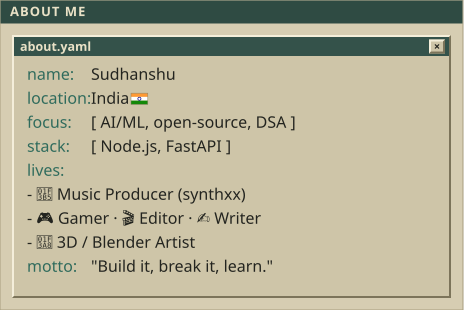</a><a href="https://github.com/sudhanshu5669/sudhanshu5669">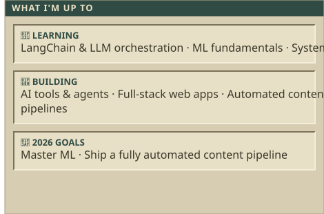</a>
<a href="https://github.com/sudhanshu5669?tab=repositories">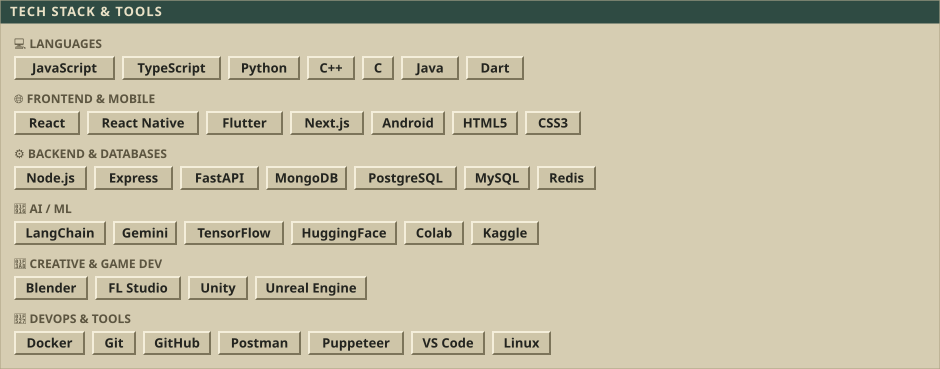</a>
<a href="https://github.com/sudhanshu5669">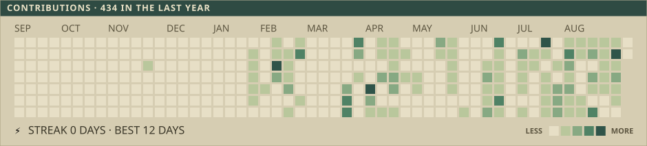</a>
<a href="https://github.com/sudhanshu5669?tab=repositories">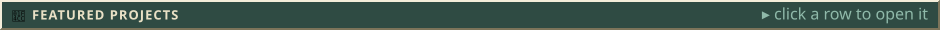</a>
<a href="https://github.com/Sudhanshu5669/Html5-Gamedev-Skill">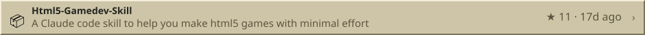</a>
<a href="https://github.com/Sudhanshu5669/Windows-styled-Portfolio">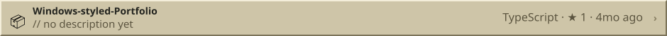</a>
<a href="https://github.com/Sudhanshu5669/Cinema-Tycoon">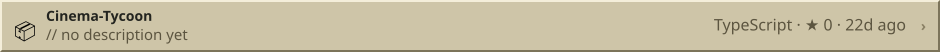</a>
<a href="https://github.com/Sudhanshu5669/Stickman-Total-Destruction">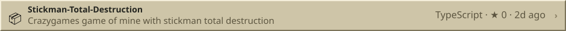</a>
<a href="https://github.com/sudhanshu5669">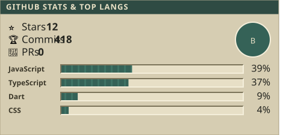</a><a href="https://leetcode.com/sudhanshu_5669/">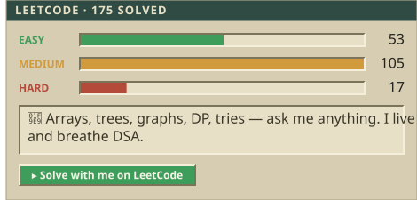</a>
<a href="https://github.com/sudhanshu5669">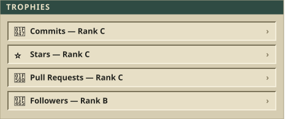</a><a href="mailto:bhartiyasudhanshu5669@gmail.com">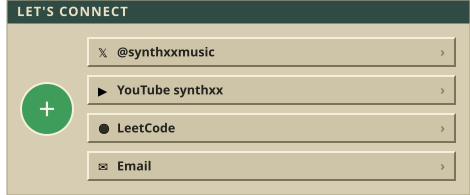</a>
<a href="https://www.youtube.com/c/synthxx">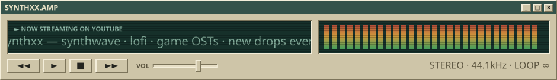</a>
<a href="https://github.com/sudhanshu5669/sudhanshu5669">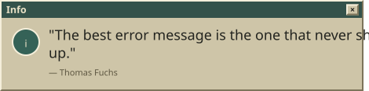</a><a href="https://github.com/sudhanshu5669/sudhanshu5669">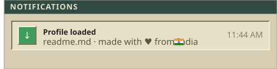</a>
<a href="https://github.com/sudhanshu5669/sudhanshu5669">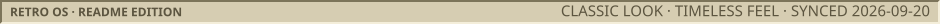</a>

<a href="https://twitter.com/synthxxmusic">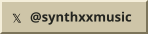</a><a href="https://www.youtube.com/c/synthxx">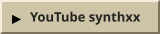</a><a href="https://www.leetcode.com/sudhanshu_5669">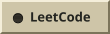</a><a href="mailto:bhartiyasudhanshu5669@gmail.com">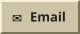</a>

<!--
  This README is generated. Do not edit it by hand.
  Edit scripts/config.mjs, then run:  npm run build
  Every section above is its own SVG slice wrapped in a link, so clicking
  a panel opens the matching page instead of the raw image file.
  The GitHub Action in .github/workflows/readme.yml refreshes the
  live numbers every day.
-->
